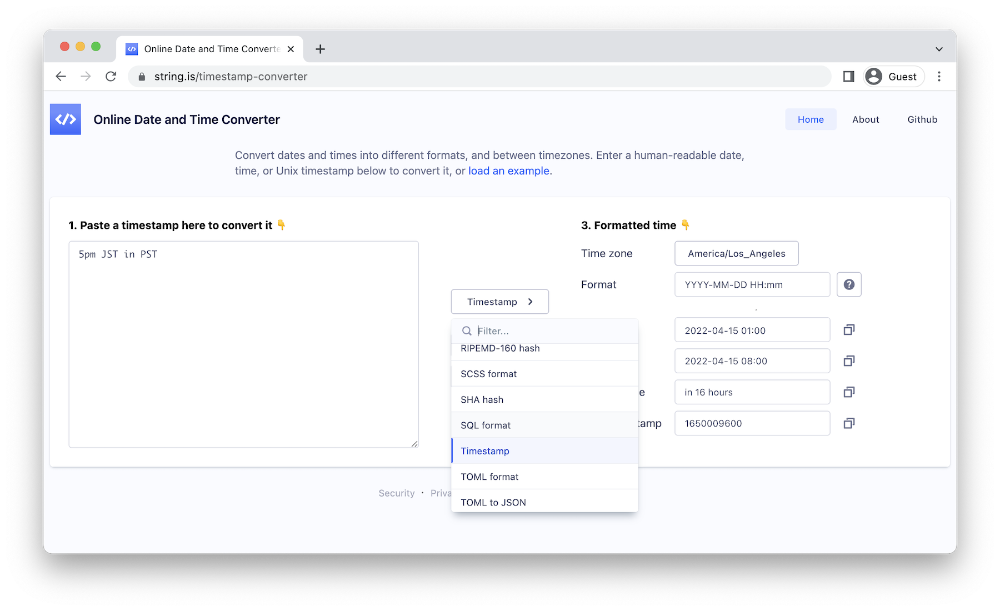

# string-is


[](https://codecov.io/gh/recurser/string-is)

[string.is](https://www.string.is/) is an open-source, privacy-friendly toolkit for developers. You can see it in action [here](https://www.string.is/).



string.is is an opinionated conversion tool, with the following goals:

- It should be open-source.
- It should not set any cookies.
- It should have a strict Content Security Policy.
- It should be extremely opinionated about dependancies, and only use well-known, well-supported libraries.
- It should try to detect the format of the input, and intelligently choose output options.


## Browser Support

string.is has been confirmed to work on Chrome, Safari, Firefox, and Edge. Internet explorer is not supported.


## Running locally

Install dependencies:

```bash
yarn install
```

Set up git hooks:

```bash
yarn husky install
```

Run the development server:

```bash
yarn dev
```

... and then open [http://localhost:3000](http://localhost:3000) in your browser.

To run all linting checks, type checks, tests, and build for production:

```bash
yarn all
```


## Running with Docker

Build the docker image:

```bash
yarn docker-build
```

or

```bash
docker build -t string-is .
```

... and then run it:

```bash
yarn docker-run
```

or

```bash
docker run -p 3000:3000 string-is
```

Alternatively you can build and run it with `docker-compose`:

```bash
docker-compose up
```

... or even run it directly from [Docker Hub](https://hub.docker.com/r/daveperrett/string-is/tags):

```bash
docker run -p 4000:3000 daveperrett/string-is:latest
````

Currently `linux/arm64` and `linux/amd64` platforms are supported.


## Adding a new converter

The `src/lib` folder contains most of the conversion logic, and is pure TypeScript, with no React knowledge required.

- `src/lib/identities` contains *identifiers* that take an input string and return the confidence level that the input is in a particular format. For example, `JwtIdentifier` returns a number indicating the confidence level (between 0 and 100) that a given input string is a JWT token.
- `src/lib/inputs` contains parsers that load strings from different formats. For example, the `JsonInput` parses a JSON string and returns an object.
- `src/lib/outputs` takes parsed data and formats it into a specific output format. For example, `JavaScriptOutput` takes a JavaScript string, formats it according to the formatting options provided, and returns the result.
- `src/lib/converters` are *input* → *output* pairs - the glue that performs a conversion between formats. For example, `CsvToJsonConverter` takes a CSV string as input, feeds it into the `CsvInput` for parsing, and pipes the result into the `JsonOutput` for formatting.

To add a new converter:

1. Decide what formats you are converting *from* and *to*. As an example, let's pretend you are writing a converter *from* plain text *to* reversed-text.
2. Check that there is an `identity` (under [src/lib/identities](https://github.com/recurser/string-is/tree/develop/src/lib/identities)) for the *from* format. In this case we are converting from plain text, and we already have a [PlainIdentity](https://github.com/recurser/string-is/tree/develop/src/lib/identities/PlainIdentity.ts), so we don't need to add a new identity. An `identity` should export (a) a `confidence` function which, given an input string, returns a number out of 100 describing the confidence that the given input matches the identity, and (b) an array of `converters` that the identity can be used with.
3. If you added a new `identity` in step (2), make sure to export it in [src/lib/identities/index.ts](https://github.com/recurser/string-is/tree/develop/src/lib/identities/index.ts).
4. Check that there is an `output` (under [src/lib/outputs](https://github.com/recurser/string-is/tree/develop/src/lib/outputs)) for the *to* format. An output should should export an `output` function which, given an input string (or possibly object, depending on the conversion taking place) and an `options` object, will convert the input into the desired output string.
5. If you added a new `output` in step (4), make sure to export it in [src/lib/outputs/index.ts](https://github.com/recurser/string-is/tree/develop/src/lib/outputs/index.ts).
6. Add a new `converter` (under [src/lib/converters](https://github.com/recurser/string-is/tree/develop/src/lib/converters)) for the `input` + `output` pair. A converter should export (a) an `operation` function which passes the input string and an `options` object to the appropriate `output`, and (b) an `outputId`, which defines which output is being used.
7. If you added a new `converter` in step (6), make sure to export it in [src/lib/converters/index.ts](https://github.com/recurser/string-is/tree/develop/src/lib/converters/index.ts). Also make sure to add entries to [locales/en/pages-converter.json](https://github.com/recurser/string-is/blob/develop/locales/en/pages-converter.json)] so that the auto-generated landing page will have the correct heading, intro text and example.
8. If you defined a new `outputId` in step (6), add a React output component (under [src/components/domain/convert/outputs](https://github.com/recurser/string-is/tree/develop/src/components/domain/convert/outputs)) to render the new kind of output. If you are re-using an existing kind of output (eg. converting to JSON or YAML) you can re-use an existing output component here.
9. If you added a new React component in step (8), make sure to export it in [src/components/domain/convert/outputs](https://github.com/recurser/string-is/tree/develop/src/components/domain/convert/outputs/index.ts).

If the appropriate `inputs`, `outputs`, `converters` and React components are in place and exported correctly, you should be able to use your new converter, given the appropriate input string that triggers a non-zero `confidence`.


## Deployment

If you want to be 100% confident that your privacy is protected, you can easily set up a string.is instance for your own personal or organizational use.

The quickest way to deploy string.is is to use the [Vercel Platform](https://vercel.com/new?utm_medium=default-template&filter=next.js) (it's free for non-commercial use). Check out their [Next.js deployment documentation](https://nextjs.org/docs/deployment) for more details. Click the `Deploy` button below to deploy this application with Vercel:

[](https://vercel.com/new/clone?repository-url=https%3A%2F%2Fgithub.com%2Frecurser%2Fstring-is&project-name=string-is&repository-name=string-is)

[Netlify](https://www.netlify.com/with/nextjs/) and [Heroku](https://elements.heroku.com/buildpacks/mars/heroku-nextjs) are also good options for free hosting. Click the `Deploy` button below to deploy this application with Heroku:

[](https://heroku.com/deploy?template=https://github.com/recurser/string-is)

Unfortunately string.is doesn't currently support static builds via `next export` (which would allow hosting on eg. S3), because the `i18n` feature it uses is not currently supported for static builds.


## Localization

string.is supports full localization. New languages should be added under the `locales/` folder in JSON format (see `locales/en/` for an example). English is currently the only locale provided, but support for new languages is welcome.


## Analytics

string.is includes support for [Plausible Analytics](https://plausible.io/), a privacy-friendly, cookie-less analytics service. To enable it, set an environment variable specifying the domain:

```
NEXT_PUBLIC_ANALYTICS_DOMAIN=string.is
```

Analytics is disabled by default unless `process.env.NODE_ENV === 'production'` and a `NEXT_PUBLIC_ANALYTICS_DOMAIN` domain is set.


## Contributing

Once you've made your changes:

1. [Fork](http://help.github.com/fork-a-repo/) string-is
2. Create a topic branch - `git checkout -b feature/add-my-new-converter`
3. Push to your branch - `git push origin feature/add-my-new-converter`
4. Create a [Pull Request](http://help.github.com/pull-requests/) from your branch
5. That's it!


## Author

[@davemetrics](http://twitter.com/davemetrics)


## Licensing

See the [LICENSE](https://github.com/recurser/string-is/blob/develop/LICENSE) for details.
